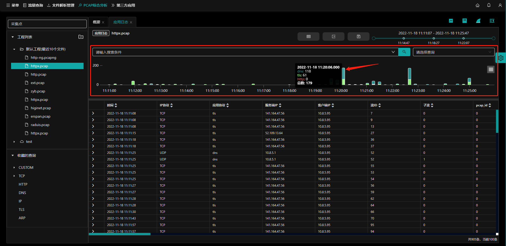

## 简介

`应用日志`能够分析pcap数据包内的应用，可分析http，tls，dns的应用日志，并跟踪这些应用日志与网络流及数据包的关联关系。

入口：【pcap综合分析】- **应用日志** 按钮

- （1）工程管理，参考[工程简介](project?id=工程简介);
- （2）收藏的查询，参考[查询简介;](query?id=查询简介)
- （3）设置显示列，参考[设置显示列](flow?id=设置显示列);
- （4）导出pcap文件，导出当前pcap文件;
- （5）保存查询，参考[新建查询;](query?id=新建查询)
- （6）pcap文件的开始与结束时间，参考 [选择时间](flow?id=选择时间)；
- （7）查询条件输入框，参考[查询条件输入框](query?id=查询条件输入框)；
- （8）**查询**按钮；
- （9）选择**已收藏的查询**语句；
  - 下拉选择已收藏的查询语句，页面会按照查询条件查询符合条件的记录；
- （10）应用日志图形显示区域；
- （11）应用日志图形操作；
- （12）应用日志列表显示区域；
- （13）应用日志摘要**显示/隐藏**按钮；

## 导出pcap文件

下载当前pcap文件。

入口：【pcap综合分析】- 【应用日志】-**下载** 按钮。

- 选择本地下载工具，保存到本地路径；

## 应用日志图形显示

图形显示的是pcap包内所有时间内的应用分析记录，默认以分钟为单位，以柱状图显示。

入口：【pcap综合分析】- 【应用日志】-应用日志图形显示区。

- 横轴显示时间，纵轴显示数量；
- 鼠标置于柱状图上，显示该时间点上的应用协议日志数量；
  - dns，tls，http；

### 图形缩放

参考[缩放图表](statInfo?id=缩放图表)；

### 图形操作

操作参考：
- [全屏查看](statInfo?id=全屏查看)；
- [打印图表](statInfo?id=打印图表)；
- [下载图片](statInfo?id=下载图片)；
- [下载pdf文档](statInfo?id=下载pdf文档)；
- [下载SVG矢量图](statInfo?id=下载SVG矢量图)；

## 应用日志列表显示

列表显示的是pcap包内所有时间内的应用分析记录，默认以分钟为单位，以列表显示。

入口：【pcap综合分析】- 【应用日志】-应用日志列表显示区。

### 作为过滤条件选中

参考[作为过滤条件选中](flow?id=作为过滤条件选中)；

### 打开pcap分析

参考[打开包解析](flow?id=打开包解析)；

### 打开流量分析

鼠标置于所选的应用日志列表任意指标栏内，点击右键，选择 **打开流量分析**。

- 以`flowId`为查询条件跳转到`流量分析`页面。

### 查看摘要信息

- （1）在应用日志列表点击摘要 **显示/隐藏** 按钮，显示所选日志的摘要信息；

- （2）在应用日志列表鼠标点击列表任意列，显示所选日志的摘要信息；

