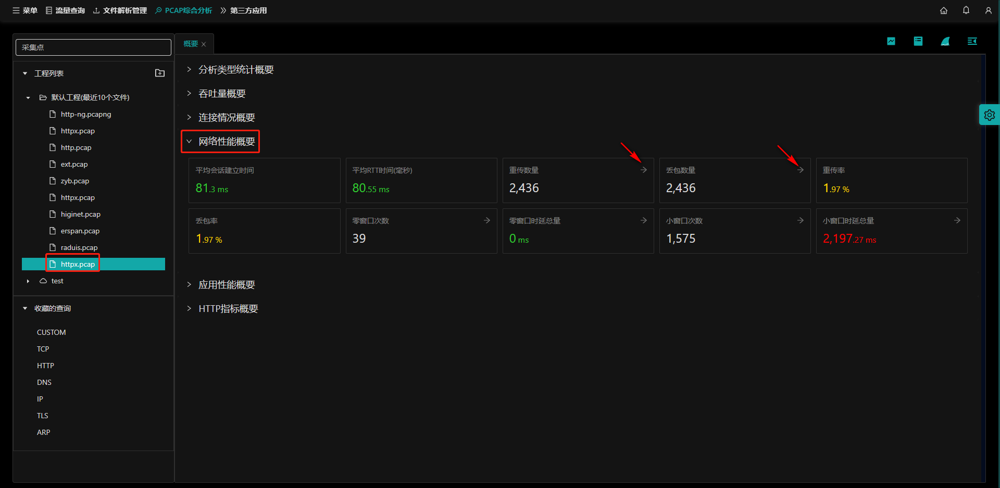

## 概要说明

打开`PCAP综合分析`首页在`连接情况概要`页面下，左侧选择工程下的pcap包，选择`网络性能概要`。

会显示该pcap包的网络性能概要信息：

- **（1）平均会话建立时间；**
- **（2）平均RTT时间(毫秒)；**
- **（3）重传数量；**
- **（4）丢包数量；**
- **（5）重传率；**
- **（6）丢包率；**
- **（7）零窗口次数；**
- **（8）零窗口延时总量；**
- **（9）小窗口次数；**
- **（10）想窗口延迟总量；**

## 指标指引

操作参考[指标指引](statInfo?id=指标指引)
