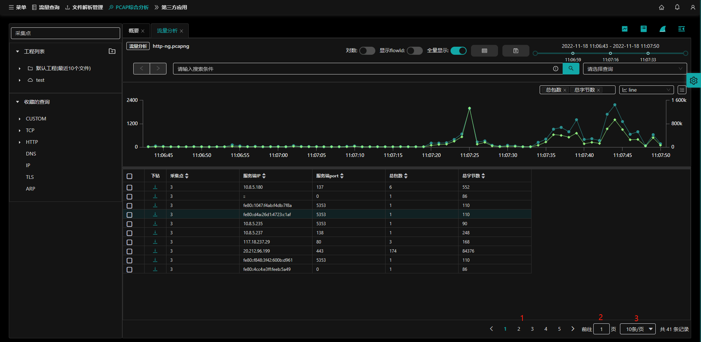
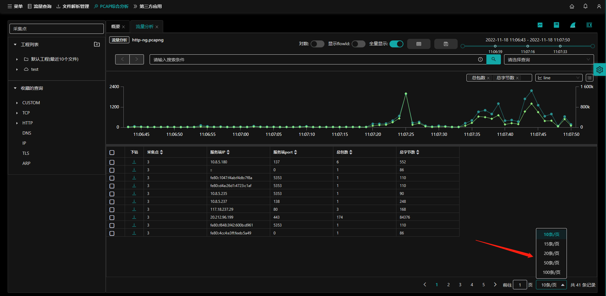

## 翻页功能

ntas中页面翻页功能提供两种方式实现：

- 鼠标点击指定数字页面；
- 输入数字到指定页面

下面以`流量分析`翻页功能介绍。

入口：【pcap综合分析】-`流量分析`页面

- （1）鼠标点击到指定页码；
- （2）输入框内输入数字后到达指定页码；
- （3）设置每页显示条数；

## 设置显示页数

鼠标点击右下角 **每页显示条数** 下拉框，选择对应数值。默认先行先试10条/页。

