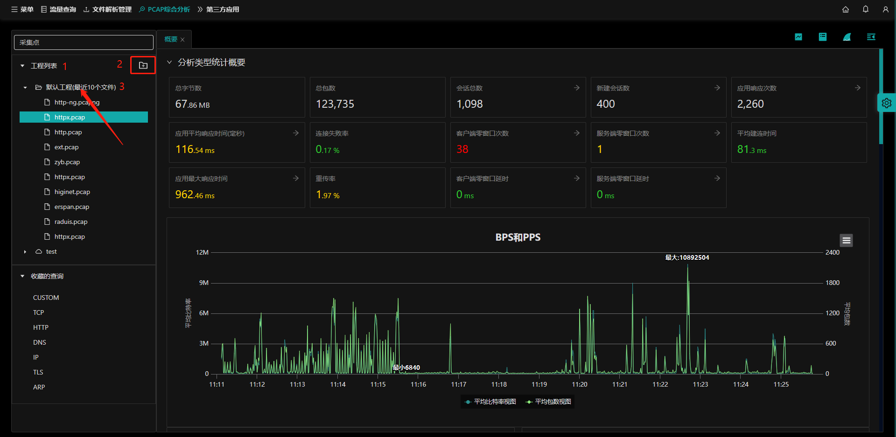
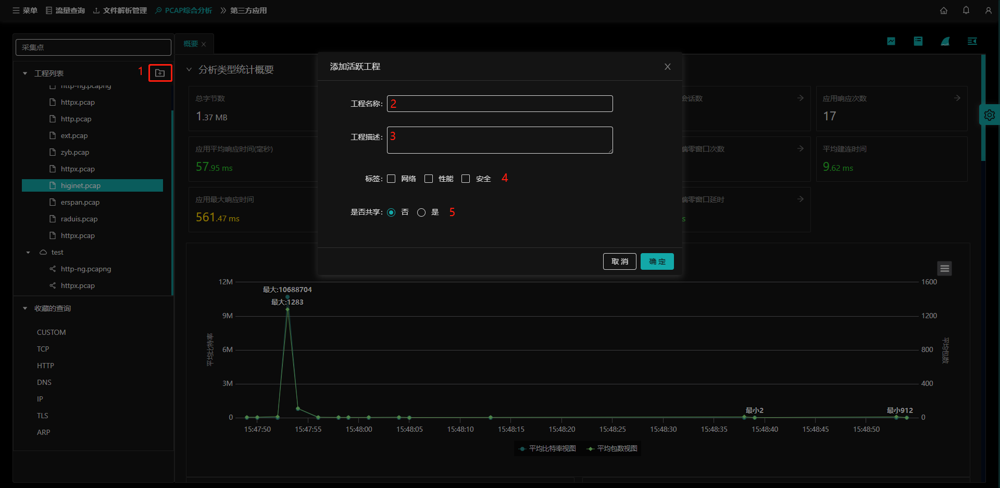
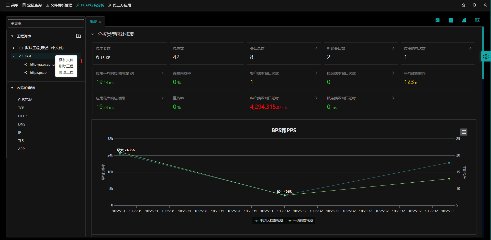
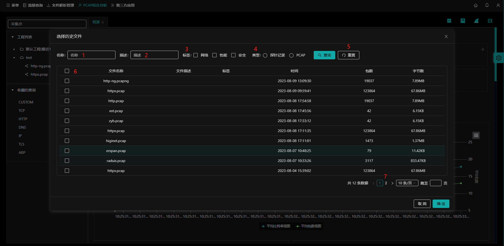
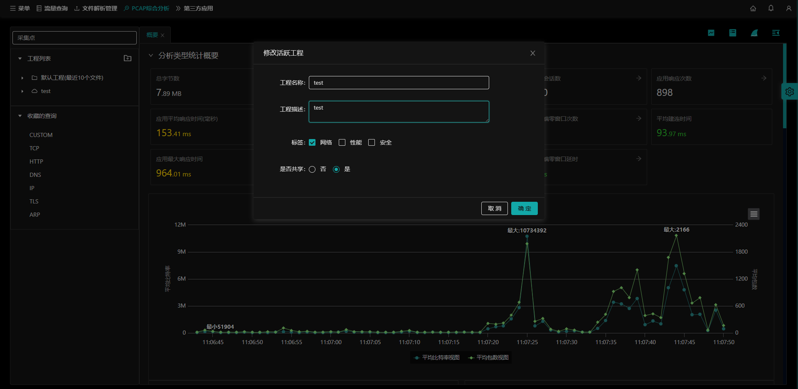
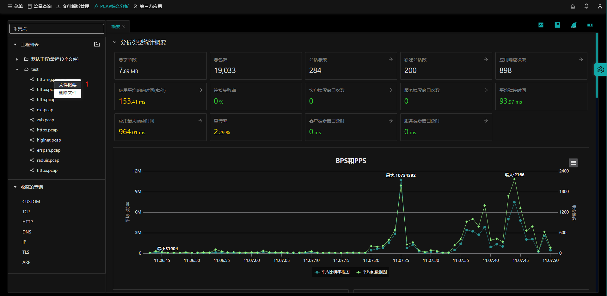
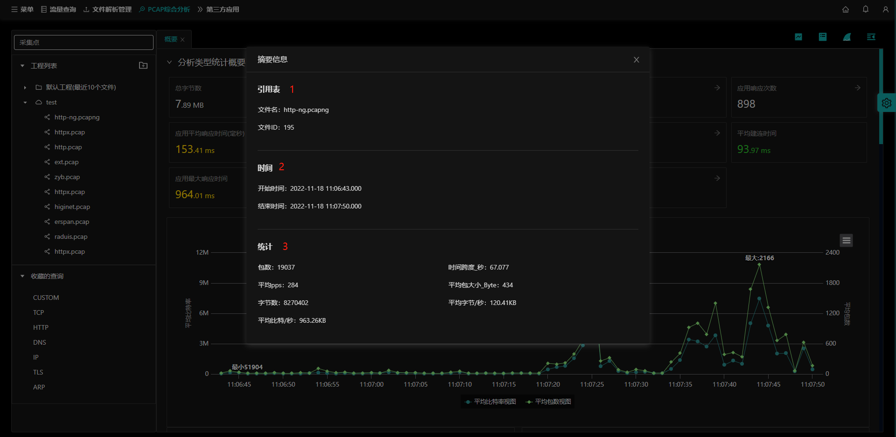
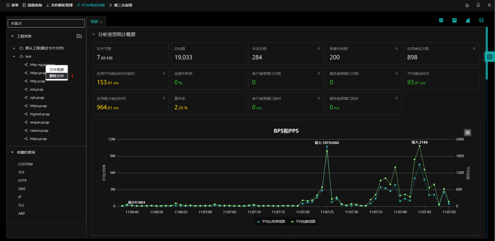

## 工程简介

​		NTAS支持对pcap的协同分析，通过建立和分享分析工程，多个工程师能够将多个pcap置于一个分析工程内进行分析验证，这种协同工作不需要将pcap文件在工程师之间互传。

入口：【PCAP综合分析】

- **(1) 工程列表**：显示当前用户下的工程列表，其中默认工程在首行；
- **(2) 添加工程** 按钮：通过该按钮添加工程；
- **(3)** `默认工程`：显示最近10个上传的PCAP文件【按照PCAP文件时间倒序排序】，其中第一个PCAP文件为最新上传的。
  - 默认工程不允许修改删除；
  - 默认工程下的pcap文件不允许删除。

## 添加工程

入口：【PCAP综合分析】-【添加工程】

- **(1) 添加工程** 按钮：点击**添加工程** 按钮；
- **(2)** **-(5)**`添加工程所需内容`：在添加工程表单分别输入`工程名称`、`工程描述`，选择`标签`与`是否共享`选项。

## 维护工程

用户可以对自建的工程做 `添加文件`、`删除工程`、`修改工程`操作。

入口：【PCAP综合分析】-鼠标右键选择工程

- **（1）自建工程维护**：自建工程允许`添加文件`、`删除工程`和`修改工程`操作。

### 添加文件

入口：【PCAP综合分析】-鼠标右键选中自建的工程，左键选择`添加文件`，进入到选择pcap文件页面

在pcap文件选择页面，按照如下条件进行选择需要添加的pcap文件

- **（1）按名称查询**：通过pcap文件名称查询，支持模糊查询；
- **（2）按描述查询：**通过pcap文件的描述内容查询，支持模糊查询；
- **（3）按标签选择：**通过pcap文件的标签选择，包含【网络、性能、安全】；
- **（4）按类型选择：**提供pcap文件的类型选择，包含【探针记录、PCAP】；
- （5）**重置** 按钮：重置查询条件；
- （6）**全选** 按钮：选择当前页的全部pcap文件；
- （7）**翻页** 按钮：选择对应页码；

选择好所需的pcap文件后，点击**确定**按钮，添加pcap文件成功。点击**取消**则返回上一页面；

### 删除工程

入口：【PCAP综合分析】-鼠标右键选中自建的工程，左键选择`删除工程`，确认删除后删除所选工程；

- 若工程下已经存在添加的pcap文件，会删除工程与pcap文件的关联关系，不会删除具体的pcap文件。
- 默认工程不允许被删除。

### 修改工程

入口：【PCAP综合分析】-鼠标右键选中自建的工程，左键选择`修改工程`

- 允许修改的工程内容包含：`工程名称`、`工程描述`、`标签`、`是否共享`；

### 文件概要

可以查看任意一个pcap文件的概要信息

入口：【PCAP综合分析】-鼠标右键选中自建工程内的pcap文件，左键选择`文件概要`

概要包含pcap包的如下信息：

- （1）引用表：pcap文件的名称及引用表；
- （2）时间：pcap文件的开始与结束时间；
- （3）统计：pcap文件的统计信息包含：包数、时间跨度、平均pps、平均包大小、字节数、平均字节、平均比特。

### 删除文件

入口：【PCAP综合分析】-鼠标右键选中自建工程内的pcap文件，左键选择`删除文件`

- 删除文件：确认删除后，该工程下的pcap文件被删除；
  - 不会删除具体的pcap文件，只是删除工程与pcap的关联关系；
  - 默认工程下的pcap不允许删除；

