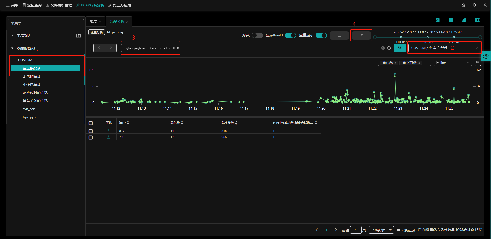

## 查询简介

​		NTAS提供按照条件查询，为`流量分析`、`应用日志`与`pcap解析`提供更方便的查询。系统本身提供一些默认查询，也支持用户自定义查询条件后保存下来，便于使用。

​		用户进入到`PCAP综合分析页面`后，在左下角有一个`收藏的查询`区域，此处显示系统默认提供的查询标签。分别进入到`流量分析`、`应用日志`及`pcap解析`页面，会各自显示不同功能页面`收藏的查询`，在各自菜单下定义的查询条件独立存在。

​		本手册`收藏查的询`以`流量分析`页面为主介绍，`应用日志`与`pcap解析`的收藏查询不再介绍。

入口：【PCAP综合分析】页面

- (1). 收藏的查询窗口：系统默认提供CUSTOM、TCP、HTTP、DNS、IP、TLS、ARP查询标签；
- (2). 删除搜索：鼠标右键点击标签/查询可以删除；
- (3). 进入到[流量分析](flow) 页面；
- (4). 进入到[应用日志](appLog) 页面；
- (5). 进入到[PCAP分析](pcap) 页面；

在`流量分析`/`应用日志`/`PCAP分析`首页，可以使用现有收藏的查询条件查询相关指标。

- (1). `流量分析`页面标签：通过点击标签，可以切换不同的pcap流量分析页面；
- (2). 查询条件输入框：查询条件输入框，按照固定语法输入；
- (3). **保存查询**按钮：点击此按钮会将当前`查询条件输入框`内的内容带入到新建查询提示框中；
- (4). **查询语法参考**按钮：点击会进入到查询语法提示框中，按照此提示编写查询条件；
- (5). **查询**按钮：点击查询，会查询出符合条件的信息；
- (6). 选择查询条件入口：选择查询，将提示当前标签页【[流量分析] /[应用日志]/[PCAP分析] 】下已有的查询条件，按需选择后会自动查询到符合条件的信息；
- (7). `流量分析`收藏的查询窗口：显示当前标签页【[流量分析] /[应用日志]/[PCAP分析] 】下收藏的查询窗口；
  - 注：`流量分析`/`应用日志`/`PCAP解析`下收藏的查询分别独立存在。

### 查询语法参考

NTAS查询提供语法参考，用户可按照提示编写自定义查询语句。用户点击**查询语法参考**按钮。显示`查询语法参考`提示框。

- (1).关键字：
  - 协议：ip.proto
  - 版本：ip.version
  - MAC：mac.srv | mac.cli
  - IP地址：ip.srv | ip.cli | ip.addr
  - 端口号：port.srv | port.cli | tcp.port
- (2).逻辑关系符：
  - 与: and &&
  - 或: or ||
  - 包含: in
  - 不包含: notin
  - 模糊: contains
- (3).比较关系符：
  - 等于: = ==
  - 大于: >
  - 小于: <
  - 大于等于: >=
  - 小于等于: <=
  - 不等于: !=

- (4).例句：

### 查询条件输入框

【PCAP综合分析】-【流量分析】页面

- (1). 在查询条件输入框中按照语法参考提示输入查询语句；
- (2). 删除输入框内容；

## 新建查询

【PCAP综合分析】-【流量分析】页面

- (1). 在`输入搜索条件`文本框中输入查询条件，点击 **保存查询** 按钮;
- (2). 保存类型包含：选择新建;
- (3). 查询标签包含：系统初始的默认标签【CUSTOM、TCP、HTTP、DNS、IP、TLS、ARP】；
- (4). 输入查询名称；
- (5). 输入查询描述；

## 修改查询（覆盖查询）

【PCAP综合分析】-【流量分析】页面

- (1). 页面左下角`收藏的查询`标签下的已存在查询；
- (2). 也可通过页面右上角的`选择查询`下拉框；
- (3). 在输入框中输入修改后的查询语句；
- (4). 点击 **保存查询** 按钮；

- (5). 在`保持搜索条件`中选择`覆盖`；
- (6). 点击 **确定** 按钮。

## 删除查询

【PCAP综合分析】-【流量分析】页面

- (1). 在`收藏的查询`中选择被删除的查询，鼠标右键点击，确认后删除该查询。

