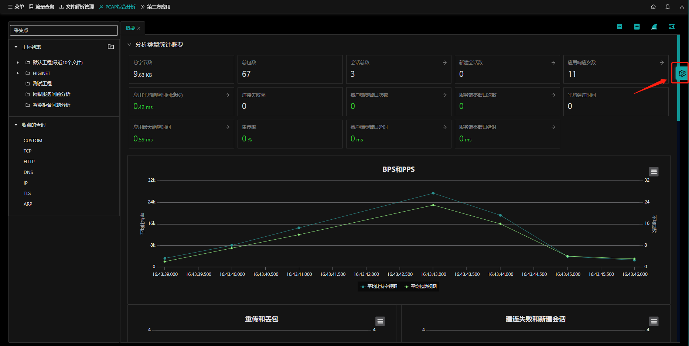
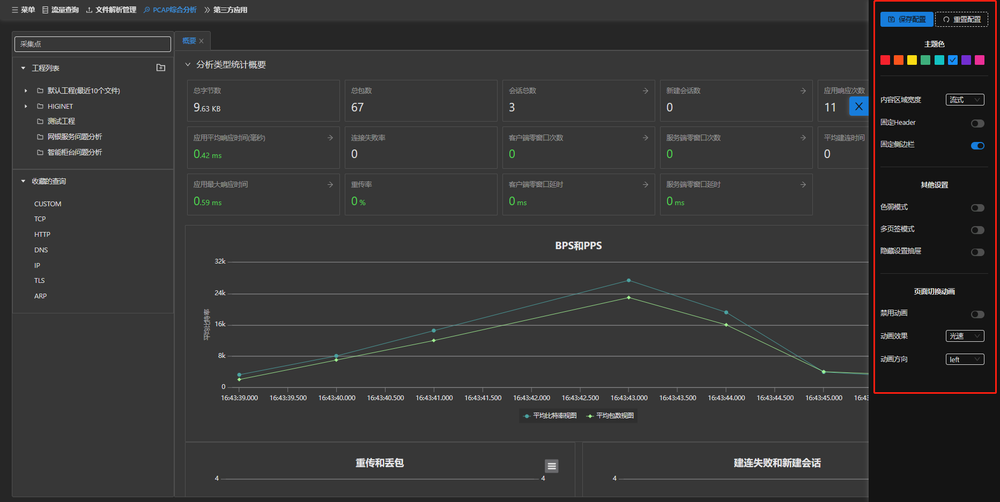

## 页面全局设置

ntas提供修改`页面全局设置`功能，自定义页面主题色、内容区域宽度、页面切换动画等显示。

入口：【文件解析管理/PCAP综合分析】，点击页面右侧齿轮图像 `设置` 按钮，进入到页面全局设置页面:

通过该设置，可以调整当前页面的 `主题色`、 `内容区域宽度`......等等页面设置，设置成功后点击 `保存配置` 按钮，点击 `重置配置` 按钮则取消修改的配置。

