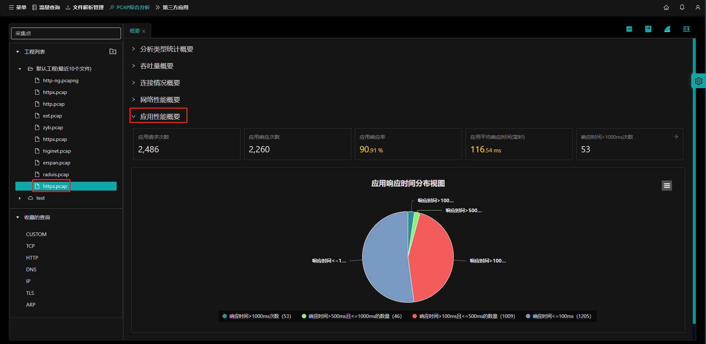

## 概要说明

打开`PCAP综合分析`首页在`网络性能概要`页面下，左侧选择工程下的pcap包，选择`应用性能概要`。

会显示该pcap包的应用性能概要信息：

- **（1）应用请求次数；**

- **（2）应用响应次数；**

- **（3）应用响应率；**

- **（4）应用平均响应时间；**

- **（5）响应时间>1000ms次数；**

  

## 指标指引

操作参考[指标指引](zh-cn/analysis/statInfo?id=指标指引)

## 指标图表操作

操作参考[指标图表操作](zh-cn/analysis/statInfo?id=指标图表操作)

