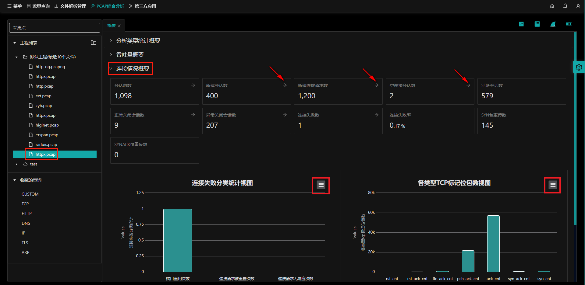

## 概要说明

打开`PCAP综合分析`首页在`吞吐量概要`页面下，左侧选择工程下的pcap包，选择`连接情况概要`。

会显示该pcap包的连接情况概要信息：

- **（1）会话总数；**

- **（2）新建会话数；**

- **（3）新建连接请求数；**

- **（4）空连接会话数；**

- **（5）活跃会话数；**

- **（6）正常关闭会话数；**

- **（7）异常关闭会话数**

- **（8）连接失败数；**

- **（9）连接失败率；**

- **（10）SYN包重传数；**

- **（11）SYNACK包重传数；**

## 指标指引

操作参考[指标指引](zh-cn/analysis/statInfo?id=指标指引)

## 指标图表操作

操作参考：
- [缩放图表](zh-cn/analysis/statInfo?id=缩放图表（横轴为时间）)；
- [全屏查看](zh-cn/analysis/statInfo?id=全屏查看)；
- [打印图表](zh-cn/analysis/statInfo?id=打印图表)；
- [下载图片](zh-cn/analysis/statInfo?id=下载图片)；
- [下载pdf文档](zh-cn/analysis/statInfo?id=下载pdf文档)；
- [下载SVG矢量图](zh-cn/analysis/statInfo?id=下载SVG矢量图)；

