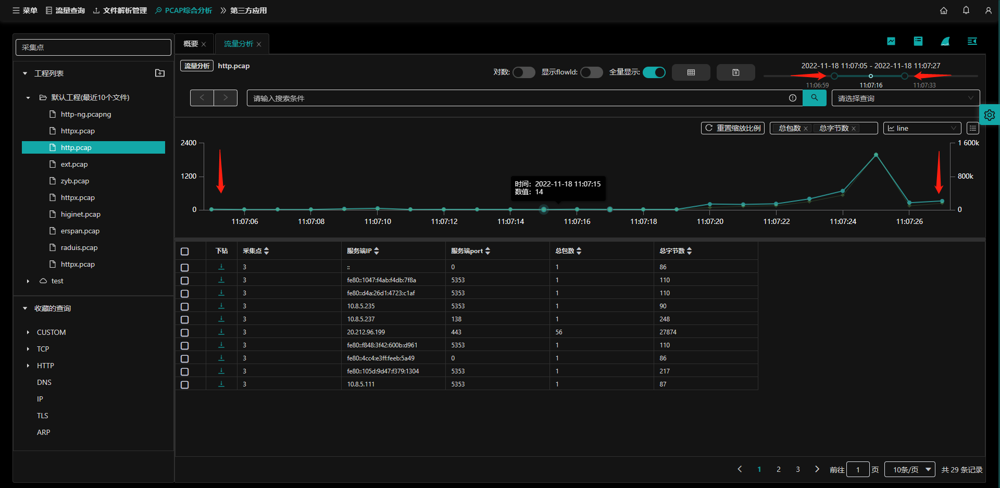

## 简介

`流量分析`通过使用自定义查询语句分析pcap包内的各项指标，便于工程师更详细的分析pcap包数据。

- （1）：用户选择工程下的pcap包；
- （2）：点击**流量分析**按钮，进入到**流量分析**页面；
  - 也可通过其他入口进入到流量分析页面，参考 [跳转流量分析](zh-cn/analysis/statInfo?id=跳转流量分析)等；

进入到流量分析页面，默认显示BPS和PPS【总包数和总字节数】。

- （1）：流量分析标签，可开启多个标签；
- （2）：是否开启对数（默认不开启）；
- （3）：是否显示flowId（默认不开启）；
- （4）：全量显示（默认开启）；
- （5）：筛选过滤：
- （6）：保存查询，参考 [收藏的查询](zh-cn/analysis/query?id=新建查询)；
- （7）：pcap文件的开始与结束时间，参考 [选择时间](zh-cn/analysis/flow?id=选择时间)；
- （8）：查询条件输入框，参考 [查询条件输入框](zh-cn/analysis/query?id=查询条件输入框)；
- （9）：查询语法参考，参考 [查询语法参考](zh-cn/analysis/query?id=查询语法参考)；
- （10）：选择查询语句；
  - 下拉选择已收藏的查询语句，页面会按照查询条件查询符合条件的记录。
- （11）：选择显示的指标（默认总包数和总字节数）；
- （12）：选择显示指标的形状（默认line）；
  - line、area、bar、column、scatter
- （13）：设置显示列；
- （14）：指标图形显示区域，显示的指标形状图，与（12）选择对应；
- （15）：流数据指标显示区域，显示的指标列，与（13）选择对应；
- （16）：翻页选择，参考 翻页
- （17）：**前进** **后退**按钮，在`流量分析`页面操作之后可以通过**前进** **后退**按钮回到所操作过的页面；
- （18）：选择流数据多选框，图形显示区域会显示所选流，可选择多条；
- （19）：下钻，选择一条流记录，过程中可以再次选择多个维度指标，最终显示在当前流数据指标显示区域内；
- （20）：工程管理，参考 [工程管理](zh-cn/analysis/project?id=工程简介)；
- （21）：收藏的查询，参考 [收藏的查询](zh-cn/analysis/query?id=查询简介)；

## 选择时间

显示pcap文件的开始与结束时间，通过鼠标拖动开始与结束时间，指标图形显示区域根据时间自动调整。

- （1）pcap文件开始时间；
- （2）pcap文件结束时间；

## 筛选过滤

流量分析页面提供显示指标的筛选与过滤，通过该设置可以按照客户需要选择适合的指标显示到当前页面。

入口：【pcap综合分析】-【流量分析】- **筛选过滤** 按钮

- （1）：维度选择标签（默认标签）；
- （2）：指标选择标签；
- （3）：指标过滤标签；
- （4）：设置详细指标区域；
- （5）：清空所选指标；

### 维度选择

按照维度标签选择所显示的指标。

- （1）：已选择指标列表；

- （2）：删除指标，点击删除所选指标；

- （3）：已选择指标，与（1）对应；

- （4）：**清空** 按钮，点击后清空所有已选择指标；

  - 选择好维`度选择`标签内的指标后，可继续点击 **指标选择**/ **指标过滤** 标签，继续选择标签；

  - 选择好`维度选择`标签内的指标后，点击 **确定** 将设置好显示的指标，点击 **取消** 将返回`流量分析`页面；

    

### 指标选择

按照指标标签选择所显示的指标。

- （1）：已选择指标列表；
- （2）：删除指标，点击删除所选指标；
- （3）：通过吞吐量/`TCP标记位`/`网络连接`/`网络性能`/`应用性能` 选择指标，与（1）对应；
- （4）：指标查询搜索框，输入关键字匹配到符合的指标，支持模糊查询；
- （5）：**清空** 按钮，点击后清空所有已选择指标；
  - 选择好`指标选择`标签内的指标后，可继续点击 **维度选择**/ **指标过滤** 标签，继续选择标签；
  - 选择好`指标选择`标签内的指标后，点击 **确定** 将设置好显示的指标，点击 **取消** 将返回`流量分析`页面；

### 指标过滤

指标过滤按照自定义条件，定义符合规定条件的指标，该模式适合高级工程师使用。支持按需选择或自定义语句筛选。

- （1）：查询条件运算符，当有多组条件时生效；
  - and、or
- （2）：过滤条件中的指标，可下拉框选择或文本输入指标【模糊查询输入】；
- （3）：过滤指标的运算符，下拉框选择；
  - 大于、小于、等于、小于等于、大于等于、like、in；
- （4）：过滤指标的值，具体要与过滤的指标相关，如：
  - 过滤指标为时间类，则值应该为日期类的时间；
  - 过滤指标为会话数/包数等，则值应该为整数；
- （5）：删除条件；
- （6）：添加一行（条件）；
- （7）：设置自定义筛选条件，当有A B C多个条件时，无法通过（1）的运算符判断执行，可使用此处的自定义模式确定如何执行A B C的执行顺序
  - 例如：${A} and (${B} or ${C})
- 选择好`指标过滤`标签内的指标后，可继续点击 **维度选择**/ **指标选择** 标签，继续选择标签；
- 选择好`指标过滤`标签内的指标后，点击 **确定** 将设置好显示的指标，点击 **取消** 将返回`流量分析`页面；

## 设置显示列

通过设置显示列，可以在`流量分析`页面显示相关的指标内容。

前置条件：已通过 [筛选过滤](zh-cn/analysis/flow?id=筛选过滤) 选择了相关的指标。

入口：【pcap综合分析】-【流量分析】- **设置显示列** 按钮。

- （1）鼠标放在 **设置显示列** 按钮上，会提示 `设置显示列`选项，默认全选已筛选的指标；
- （2）在设置显示列选项上，鼠标左键选择指标，勾选为选择，不勾选为不选择。
- （3）选择或不选择后立即生效。

## 选择显示指标

通过设置显示指标，可以在`流量分析`页面图形显示区显示相关的指标内容。

前置条件：已通过 [设置显示列](zh-cn/analysis/flow?id=设置显示列) 选择了相应的指标。

入口：【pcap综合分析】-【流量分析】- **设置显示指标** 下拉框。

- （1）在`设置显示指标`下拉框中选择需要在图形中显示的指标，选择后立即生效。
  - 最多可以选择两个指标，以双纵轴显示在图形上。

## 选择显示指标形状

通过设置显示指标形状，可以在`流量分析`页面图形显示区显示不同形状的图形。

前置条件：已通过 [选择显示指标](zh-cn/analysis/flow?id=选择显示指标) 选择了需要显示的指标。

入口：【pcap综合分析】-【流量分析】- **设置显示指标形状** 下拉框。

- （1）area，显示指标为区域显示图形。

  

- （2）line，显示指标为线性显示图形（默认）。

- （3）bar，显示指标为条形图。

  - 横轴为数值
  - 纵轴为时间

  

- （4）column，显示指标为柱状图。

  

- （5）scatter，显示指标为点状图。

  

## 显示流数据对比图

在流数据指标显示列表中，勾选不同流，会在图形显示区域显示各流的对比图。

前置条件：已通过 [选择显示指标](zh-cn/analysis/flow?id=选择显示指标) 选择了需要在图形上显示的指标。

入口：【pcap综合分析】-【流量分析】- **选择流** 多选框。

- 鼠标选中多条流，图形显示区域会自动渲染出不同流的线形图【或已设置的其他图形】。

### 显示图形跳转pcap解析

在流数据指标显示列表中，勾选不同流，会在图形显示区域显示各流的对比图。

前置条件：已通过 [选择显示指标](zh-cn/analysis/flow?id=选择显示指标) 选择了需要在图形上显示的指标。

入口：【pcap综合分析】-【流量分析】-指标图形显示区域。

- 鼠标置于图形显示区域的任意流数据上，点击左键，进入到所选流在该时间的`PCAP解析`页面中。

## 流数据操作

在`流量分析`页面指标列表中，通过鼠标右键对所选流 **作为过滤条件**、**打开应用日志** 、 **打开包解析** 和 **下载** 操作。

前置条件：`流量分析`页面已选中 **显示flowId**。

入口：【pcap综合分析】-【流量分析】-指标列表显示区域。

- 已选择 **显示flowId** 选项；
- 

### 作为过滤条件选中

鼠标置于所选的流任意指标栏内，点击右键，选择 **作为过滤条件** 选中

- 鼠标在`流ID`指标栏内，则`查询条件输入框`内显示该流ID作为查询条件；
- 鼠标在其他任意指标栏内，则`查询条件输入框`内显示该指标作为查询条件；

### 打开应用日志

鼠标置于所选的流任意指标栏内，点击右键，选择 **打开应用日志** 

- 以`flowId`为查询条件跳转到`应用日志`页面。

### 打开包解析

鼠标置于所选的流任意指标栏内，点击右键，选择 **打开包解析** 

- 以`flowId`为查询条件跳转到`PCAP分析`页面。

### 下载

鼠标置于所选的流任意指标栏内，点击右键，选择 **下载** 

- 调用系统默认下载工具，下载所选流到pcap文件。

## 下钻

下钻过程中可以再次选择多个维度指标，最终显示在当前流数据指标显示区域内，方便对流数据的分析。

入口：【pcap综合分析】-【流量分析】-指标列表显示区域。

- 在`流量分析`页面指标列表中，选择流点击 **下钻** 图标；
- 在`设置过滤条件`中选择指标；
- 确定后显示下钻后的指标显示列表。

## 翻页功能

`流量分析`翻页功能提供两种方式：

- 鼠标点击指定数字页面；
- 输入数字到指定页面

- （1）鼠标点击到指定页码；
- （2）输入框内输入数字后到达指定页码；
- （3）设置每页显示条数；

### 设置每页显示条数

鼠标点击右下角 **每页显示条数** 下拉框，选择对应数值。默认先行先试10条/页。

