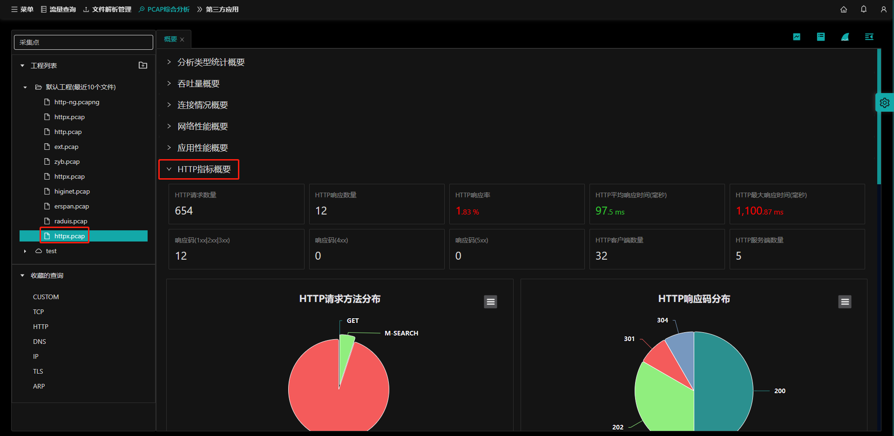
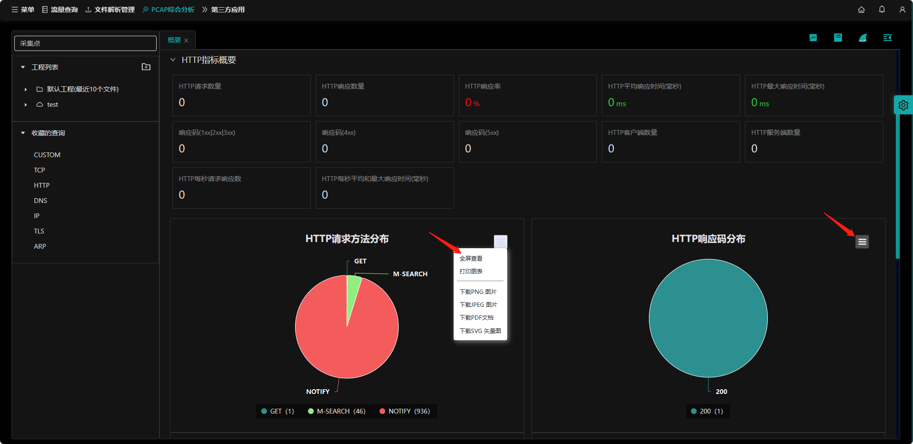

## 概要说明

打开`PCAP综合分析`首页在`应用性能概要`页面下，左侧选择工程下的pcap包，选择`http指标概要`。

会显示该pcap包的http指标概要信息：

- **（1）HTTP请求数量；**

- **（2）HTTP响应数量；**

- **（3）HTTP响应率；**

- **（4）HTTP平均响应时间(毫秒)；**

- **（5）HTTP最大响应时间(毫秒)；**

- **（6）响应码(1xx|2xx|3xx)；**

- **（7）响应码(4xx)；**

- **（8）响应码(5xx)；**

- **（9）HTTP客户端数量；**

- **（10）HTTP服务端数量；**

  

## 指标指引

操作参考[指标指引](zh-cn/analysis/statInfo?id=指标指引)

## 指标图表操作

操作参考：
- [全屏查看](zh-cn/analysis/statInfo?id=全屏查看)；
- [打印图表](zh-cn/analysis/statInfo?id=打印图表)；
- [下载图片](zh-cn/analysis/statInfo?id=下载图片)；
- [下载pdf文档](zh-cn/analysis/statInfo?id=下载pdf文档)；
- [下载SVG矢量图](zh-cn/analysis/statInfo?id=下载SVG矢量图)；