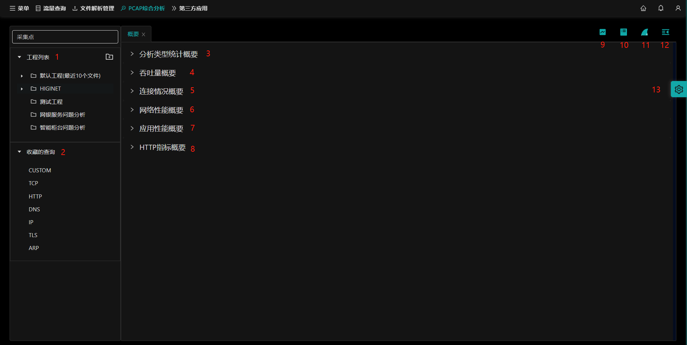

## 1.概述<!-- {docsify-ignore-all} -->

`PCAP综合分析`是NTAS的核心功能模块，对流量包进行多维度的统计，包含了`分析类型统计概要`、`吞吐量概要`、`连接情况概要`、`网络性能概要`、`应用性能概要`、`HTTP指标概要`。同时对pcap包进行详细分析，包含`流量分析`、`应用日志`、`PCAP分析`。

下面将详细介绍`pcap综合分析`页面的使用与说明。

- [1.工程管理](/zh-cn/analysis/project)

- [2.收藏的查询](/zh-cn/analysis/query)

- [3.分析类型统计概要](zh-cn/analysis/statInfo) 

- [4.吞吐量概要](zh-cn/analysis/throughput) 

- [5.连接情况概要](zh-cn/analysis/connection) 

- [6.网络性能概要](zh-cn/analysis/net) 

- [7.应用性能概要](zh-cn/analysis/appInfo) 

- [8.http指标概要](zh-cn/analysis/http) 

- [9.流量分析](zh-cn/analysis/flow) 

- [10.应用日志](zh-cn/analysis/appLog) 

- [11.PCAP分析](zh-cn/analysis/pcap) 

- [12.折叠/展开](zh-cn/analysis/window) 

- [13.全局设置](zh-cn/analysis/setting) 
