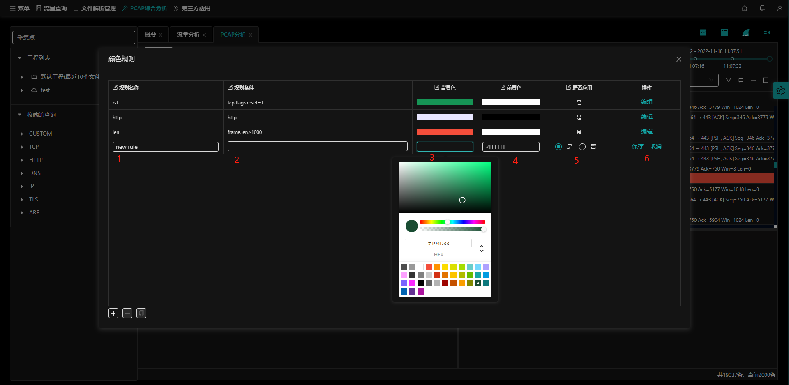

## 简介

`PCAP分析`可以直接上手包分析功能，支持端点统计、包查询解码、子查询、I/O图表、TCP流形、过滤器颜色分组等功能。

入口：【pcap综合分析】- **PCAP分析** 按钮

- （1）：工程管理，参考[工程管理](zh-cn/analysis/project?id=工程简介)；
- （2）：收藏的查询，参考 [收藏的查询](zh-cn/analysis/query?id=查询简介)；
- （3）：颜色规则，根据指标条件，自定义设置包显示颜色；
- （4）：流图，以列的形式（时间），将主机之间的连接显示出来（横轴）；
- （5）：统计信息，包的统计信息，以conversations（会话）和endpoint（端点）维度统计；
- （6）：IO/Graphs，显示pcap包文件中的整体流量情况，自定义指标及聚合显示字段；
- （7）：设置显示列，参考[设置显示列](zh-cn/analysis/flow?id=设置显示列);
- （8）：保存查询，参考 [收藏的查询](zh-cn/analysis/query?id=新建查询)；；
- （9）：导出，[导出pcap文件](zh-cn/analysis/appLog?id=导出pcap文件)；
- （10）：pcap文件的开始与结束时间，参考 [选择时间](zh-cn/analysis/flow?id=选择时间)；
- （11）：查询条件输入框，参考 [查询条件输入框](zh-cn/analysis/query?id=查询条件输入框)；
- （12）：**查询**按钮；
- （13）：选择**已收藏的查询**语句；
  - 下拉选择已收藏的查询语句，页面会按照查询条件查询符合条件的记录。
- （14）：包显示列表区域；
- （15）：包详情区域，网络包在协议栈各层的详细信息；
  - 分别显示链路层、IP层等信息
- （16）：包字节显示区域；

## 包列表操作

在包列表页面点击鼠标右键，有多种选择，对所选包进行精准操作。

- （1）标识/取消标识包；
- （2）作为过滤条件（选中）；
- （3）追踪流【TCP/UDP】；
- （4）打开应用日志；
- （5）打开流量分析；

### 标识/取消标识包

鼠标右键选择包列表内的包，选择 **标识/取消标识包**，会标记该条包，显示为红色背景色。

- 取消标识包，会取消之前标识的包，背景色改为默认色。

### 作为过滤条件（选中）

以所选包的列为查询条件，输入到搜索条件输入框内，参考[作为过滤条件选中](zh-cn/analysis/flow?id=作为过滤条件选中)

### 追踪流

鼠标右键选择包列表内的包，选择 **追踪流**-**TCP/UDP**，以该包的flowid为查询条件，输入到搜索条件输入框内。配合`流图`功能一起使用，参考 [流图](zh-cn/analysis/pcap?id=流图)。

注：配合`搜索条件输入框`用过滤条件选择出对应的TCP与UDP协议的包。

### 打开应用日志

以所选包的flowid为查询条件，打开应用日志。参考[打开应用日志](zh-cn/analysis/flow?id=打开应用日志)。

### 打开流量分析

以所选包的flowid为查询条件，打开流量查询。参考[打开流量分析](zh-cn/analysis/appLog?id=打开流量分析)。

## 数据包详情

网络包在协议栈各层的详细信息，包括：物理层、链路层、网络层、传输层等。

- 物理层数据信息；
- 数据链路层数据信息；
- 网络层IPV4信息；
- 传输层TCP协议信息；

## 数据包字节

显示16进制的包字节数据。

## 颜色规则设置

根据指标条件，设置对应的颜色，在pcap分析页面显示对应颜色，方便用户对比。

入口：【pcap综合分析】-【PCAP分析】- **颜色规则** 按钮

- （1）：添加颜色规则；
- （2）：删除颜色规则；
- （3）：复制一条颜色规则；
- （4）：修改颜色规则；

### 添加颜色规则

点击**+**按钮，依次在文本框按提示输入，并点击**保存**按钮。

- （1）为方便辨别，规则名称不重复；
- （2）规则条件按照指标表达式填写，当达到此规则后，包分组会显示对应设置的颜色；
- （3）背景色是显示包的背景颜色，；
- （4）前景色是显示包的文字颜色；
- （5）通过选择“是否应用”确定规则生效；
- （6）**保存**与**取消**按钮；

- 例：以上设置了规则条件：frame.time_delta = 8.407823，背景色为绿色，前景色为粉色后，包的显示情况。

### 删除颜色规则

鼠标左键选择规则，点击 **-** 按钮，按照提示选择删除。

### 复制颜色规则

鼠标左键选择规则，点击 **** 按钮，按照提示选择删除。

- 在复制出的颜色规则中，自定义填写规则名称、规则条件、颜色等信息。

## 流图

流图的功能是可以将连接可视化，并将一段时间的数据流显示出来， 以列的形式（时间），将主机之间的连接显示出来（横轴），然后将数据组织在一起，便于直观的解读

入口：【pcap综合分析】-【PCAP分析】- **流图** 按钮

注：配合`追踪流`或`查询语句`功能， 精准查看`流图`，参考  [追踪流](zh-cn/analysis/pcap?id=追踪流) 。

## 统计信息

分别统计包的端点（Endpoints）与会话（Conversations）信息。

- （1）统计的会话与端点协议，IPV4、IPV6、TCP、UDP；
- （2）会话（Conversations）与端点（Endpoints）下拉选择；
- （3）搜索条件框；
- （4）摘要信息；

### 端点（Endpoints）

统计了每一端点的信息，包括每个端点的地址、传输发送数据包的数量和字节数。

入口：【pcap综合分析】-【PCAP分析】- **统计信息** 按钮- **EndPoints** 下拉选择。

- （1）IPV4端点统计信息；
- （2）IPV6端点统计信息；
- （3）TCP端点统计信息；
- （4）UDP端点统计信息；
- （5）端点下拉选择框；
- （6）端点列表鼠标右键选择条件，会以当前端点address作为查询条件，显示在`pcap分析`首页搜索条件输入框中；
- （7）搜索条件输入框；
- （8）包摘要信息，统计开始、结束时间与包的大小及一些统计指标。

### 会话（Conversations）

以地址A（Address A）和地址B（Address B）显示了会话中端点的地址，以及每个设备发送或接收到的数据包和字节数。

入口：【pcap综合分析】-【PCAP分析】- **统计信息** 按钮- **Conversations** 下拉选择。

- （1）IPV4会话统计信息；
- （2）IPV6会话统计信息；
- （3）TCP会话统计信息；
- （4）UDP会话统计信息；
- （5）过滤条件表达式，会话列表鼠标右键选择条件，会以当前会话ip_A与ip_B的关系作为查询条件，显示在`pcap分析`首页搜索条件输入框中；
- （6）搜索条件输入框；
- （7）会话下拉选择框；
- （8）包摘要信息，统计开始、结束时间与包的大小及一些统计指标。

## I/O Graphs

IO graph会显示pcap包文件中的过滤数据并且以图表形式显示出来，通常是设置过滤条件，显示聚合字段（通过函数聚合）。默认X轴时间间隔是10秒，Y轴是每一时间间隔的聚合字段数。

入口：【pcap综合分析】-【PCAP分析】- **I/OGraphs** 按钮。

- （1）graphs定义示例；
- （2）图表操作按钮，参考 [指标图表操作](zh-cn/analysis/statInfo?id=指标图表操作)；
- （3）图形显示区域；
- （4）选择graphs，可以选择多条，同步显示到图形显示区域；
- （5）修改graphs；
- （6）删除graphs；
- （7）添加graphs；
- （8）复制graphs；
- （9）设置图形显示区域间隔，默认10秒；
  - 可以设置1毫秒、10毫秒、100毫秒、1秒、10秒、1分钟、10分钟；
- （10）图形显示形状，默认折线图；
  - 其他选择：柱状图、面积图、散点图；

### 添加graphs

入口：【pcap综合分析】-【PCAP分析】- `I/OGraphs` 页面-**添加**按钮。

- （1）输入graphs名称；
- （2）设置过滤条件；
- （3）选择聚合函数，对所选的聚合字段进行聚合函数操作，最终值显示到图形列表上；
  - package、Bytes、Bits、SUM、MAX、MIN、AVG、count；
- （4）选择聚合字段，下拉选择或输入需要聚合的指标；

### 修改graphs

入口：【pcap综合分析】-【PCAP分析】- `I/OGraphs` 页面-**修改**按钮。

修改的表单参考[添加graphs](zh-cn/analysis/pcap?id=添加graphs)；

### 删除graphs

入口：【pcap综合分析】-【PCAP分析】- `I/OGraphs` 页面-**删除**按钮。

删除一条graphs记录。

### 复制graphs

入口：【pcap综合分析】-【PCAP分析】- `I/OGraphs` 页面-**复制**按钮。等同于新建一条graphs记录。

选择一条被复制的graphs，点击 **复制** 按钮，输入的表单内容参考[添加graphs](zh-cn/analysis/pcap?id=添加graphs)；

### 设置显示间隔

入口：【pcap综合分析】-【PCAP分析】- `I/OGraphs` 页面-**时间选择** 下拉框，选择显示间隔。

### 设置显示图形

入口：【pcap综合分析】-【PCAP分析】- `I/OGraphs` 页面-**折线图** 下拉框，选择显示图形。

