打开`PCAP综合分析`首页默认显示`分析类型统计概要`页面【默认工程下的首个pcap包】，同时也提供数据包的`吞吐量概要`、`连接情况概要`、`网络性能概要`、`应用性能概要`、`HTTP指标概要`等页面，通过这些概要统计及分析工程师可快速定位到异常网络会话和数据包。

## **概要说明**

打开`PCAP综合分析`首页，左侧选择工程下的pcap包。

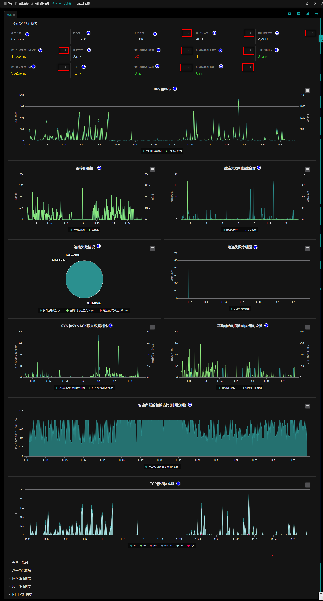

**统计概要具体统计如下指标：**

- **（1）总字节数；**
- **（2）总包数；**
- **（3）会话总数；**
- **（4）新建会话数；**
- **（5）应用响应次数；**
- **（6）应用平均响应时间（毫秒）；**
- **（7）连接失败率；**
- **（8）客户端零窗口次数；**
- **（9）服务端零窗口次数；**
- **（10）平均建连时间数；**
- **（11）应用最大响应时间；**
- **（12）重传率数；**
- **（13）客户端零窗口延时；**
- **（13）客户端零窗口延时；**
- **（14）服务端零窗口延时；**
- **（15）BPS和PPS；**
  - 横轴为时间；
  - 双Y轴分别显示平均比特率试图和平均包数视图；

- **（16）重传和丢包；**
  - 横轴为时间；
  - 双Y轴分别显示丢包率视图和重传率；

- **（17）建连失败和新加会话；**
  - 横轴为时间；
  - 双Y轴分别显示新建会话数和连接失败数；

- **（18）连接失败情况；**
  - 显示端口重用次数、连接请求被重置次数、连接请求无响应次数；

- **（19）连接失败率视图；**
  - 横轴为时间；
  - 纵轴为建连失败率；

- **（20）SYN和SYNACK报文数据对比；**
  - 横轴为时间；
  - 双Y轴分别显示SYNACK包个数（按秒统计）和SYN包个数（按秒统计）；

- **（21）平均响应时间和响应超时次数；**
  - 横轴为时间；
  - 双Y轴分别显示响应超时次数和平均响应时间（毫秒）；

- **（22）包含负载的包数占比（时间分组）；**
  - 横轴为时间；
  - 纵轴为包负载的包数占比（时间分组）；

- **（23）TCP标记位堆叠；**
  - 横轴为时间；
  - 多Y轴分别显示fin、rst、psh、syn_ack、ack、syn；

## 指标指引

统计数据为绿色字体的说明该指标正常；

统计数据为黄色字体的说明该指标已达到警告阈值，可通过鼠标左键点击进入到流量分析页面，自动显示该指标相关的指标列；

统计数据为红色字体的说明该指标存在风险；可通过鼠标左键点击进入到流量分析页面，自动显示该指标相关的指标列；

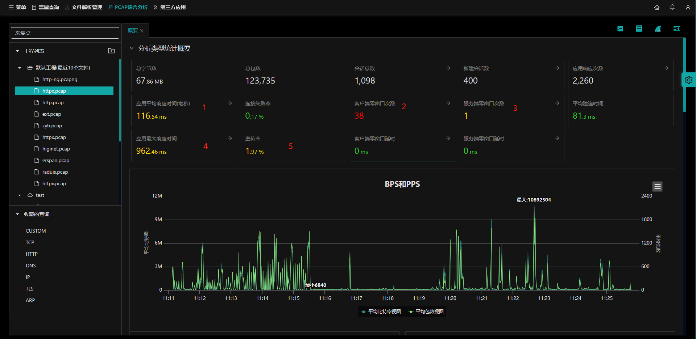

- **（1）-（4）：**以上1-4指标右侧带**->**的均可通过鼠标左键点击进入到详细的`流量分析`页面，每个指标的默认显示列均与该指标相关。

  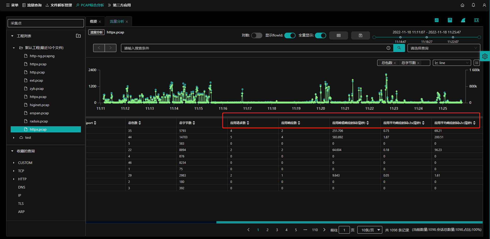

  

  

## 指标图表操作

提供对各种指标图表显示的详细操作，提升用户体验。

### 跳转`流量分析`

鼠标置于图表的数据上【11:15:30】，显示为小手【非指针】点击左键，跳转到`流量分析`页面。

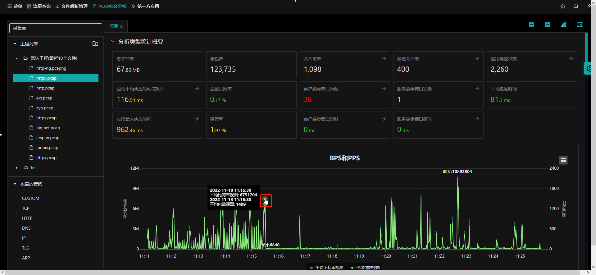

`流量分析`页面显示该指标在所选时间1分钟内的图表【11:15:00--11:15:59】

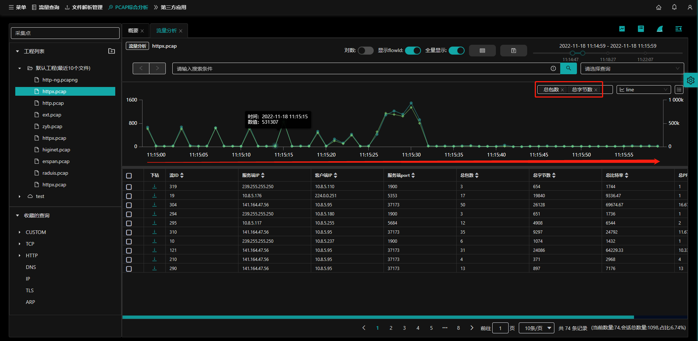

### 缩放图表（横轴为时间）

所有指标凡是横轴为时间单位的，均可通过鼠标操作查看所选时间区间的指标。

- （1）：鼠标置于所选时间点图表上；
- （2）：按住鼠标左键，向所需时间左移/右移【移动时所选择的区间会深色显示】；
- （3）：移动到目的时间释放鼠标左键；

例：BPS与PPS表操作

**原始表时间区间显示的数据：**

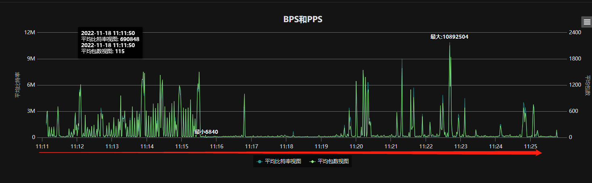

**移动鼠标选择时间区间：(11:12:01--11:15:01)：**

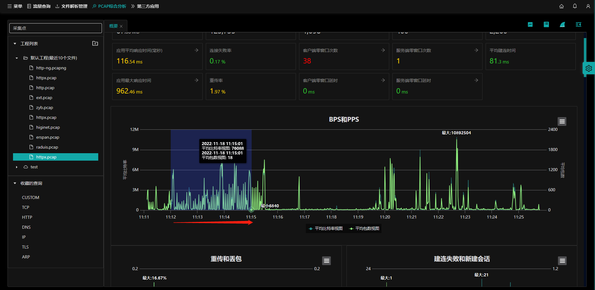

**所选时间区间内的数据（放大）：**

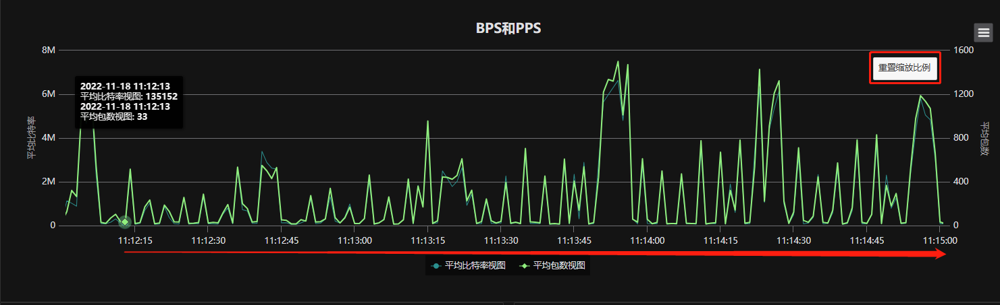

- 点击右上角 **重置缩放比例** 按钮返回原始图表数据。

  

### 多纵轴指标显示

纵轴显示的指标可通过点击图例选择所需要展示的数据。

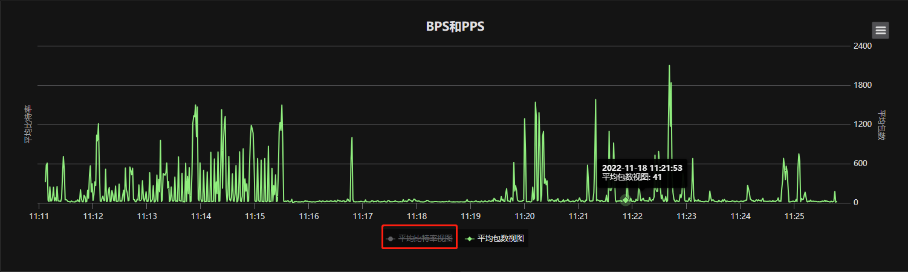

- 鼠标左键点击**平均比特率视图**，该指标将不再显示，再次点击会再次显示；
- 其他指标均可通过鼠标点击选择与否显示到纵轴上。

### 全屏查看

所有指标图表均可通过隐藏按钮展示图表的各类操作：全屏查看、打印图表、下载PNG图片、下载JPEG图片、下载PDF文档、下载SVG矢量图。

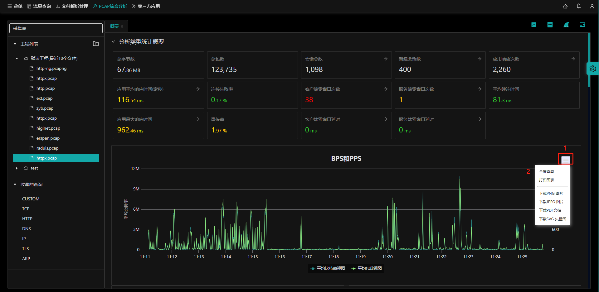

鼠标左键点击右侧【1】按钮，选择`全屏查看`。

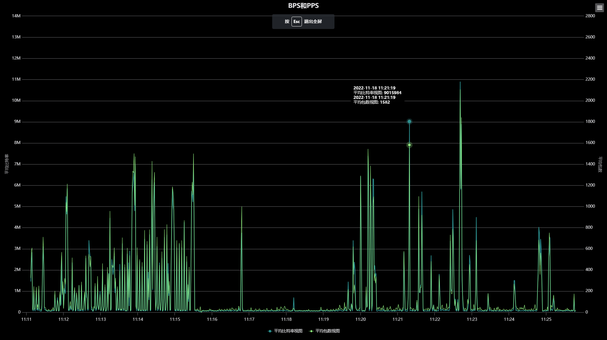

按ESC可以退出全屏。

### 打印图表

鼠标左键点击右侧【1】按钮，选择`打印图表`，会调用本地打印机程序，选择合适的打印机打印图表。

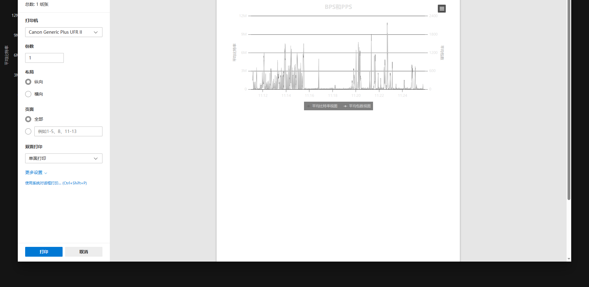

### 下载图片

鼠标左键点击右侧【1】按钮，选择`下载PNG图片`/`下载JPEG图片`，会调用本地下载程序，下载所选格式的图片到本地。

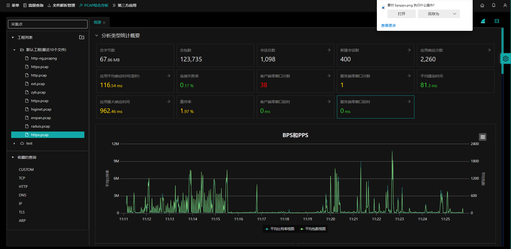

### 下载pdf文档

鼠标左键点击右侧【1】按钮，选择`下载PDF文档`，会调用本地下载程序，下载PDF文档到本地。

### 下载svg矢量图

鼠标左键点击右侧【1】按钮，选择`下载SVG矢量图`，会调用本地下载程序，下载SVG矢量图到本地。

