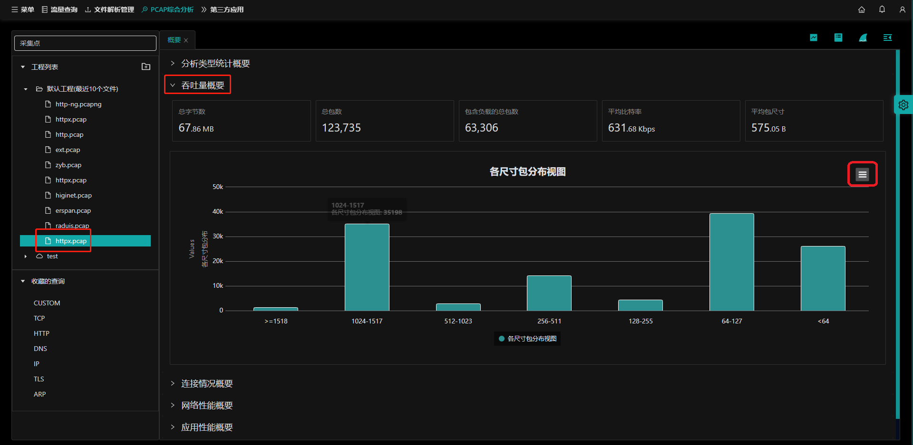

## 概要说明

打开`PCAP综合分析`首页在`分析类型统计概要`页面下，左侧选择工程下的pcap包，选择`吞吐量概要`。

会显示该pcap包的吞吐量概要信息：

- **（1）总字数；**
- **（2）总包数；**
- **（3）包含负载的总包数；**
- **（4）平均比特率；**
- **（5）平均包尺寸；**

## 指标图表操作

操作参考[指标图表操作](zh-cn/analysis/statInfo?id=指标图表操作)