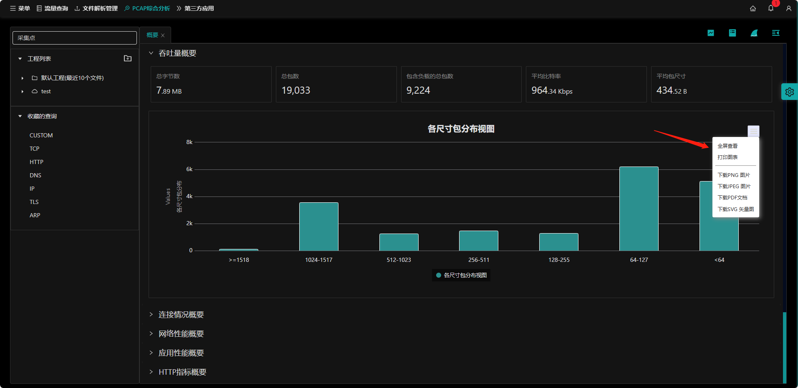

## 概要说明

打开`PCAP综合分析`首页在`分析类型统计概要`页面下，左侧选择工程下的pcap包，选择`吞吐量概要`。

会显示该pcap包的吞吐量概要信息：

- **（1）总字数；**
- **（2）总包数；**
- **（3）包含负载的总包数；**
- **（4）平均比特率；**
- **（5）平均包尺寸；**

## 指标图表操作

操作参考：
- [缩放图表](zh-cn/analysis/statInfo?id=缩放图表（横轴为时间）)；
- [全屏查看](zh-cn/analysis/statInfo?id=全屏查看)；
- [打印图表](zh-cn/analysis/statInfo?id=打印图表)；
- [下载图片](zh-cn/analysis/statInfo?id=下载图片)；
- [下载pdf文档](zh-cn/analysis/statInfo?id=下载pdf文档)；
- [下载SVG矢量图](zh-cn/analysis/statInfo?id=下载SVG矢量图)；