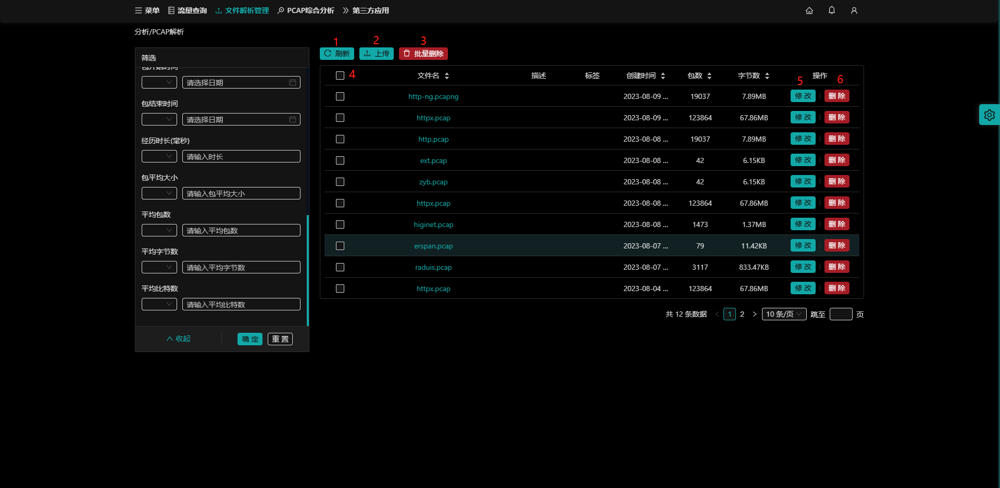
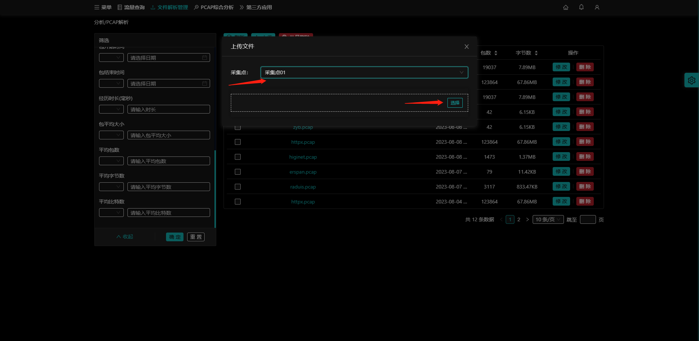
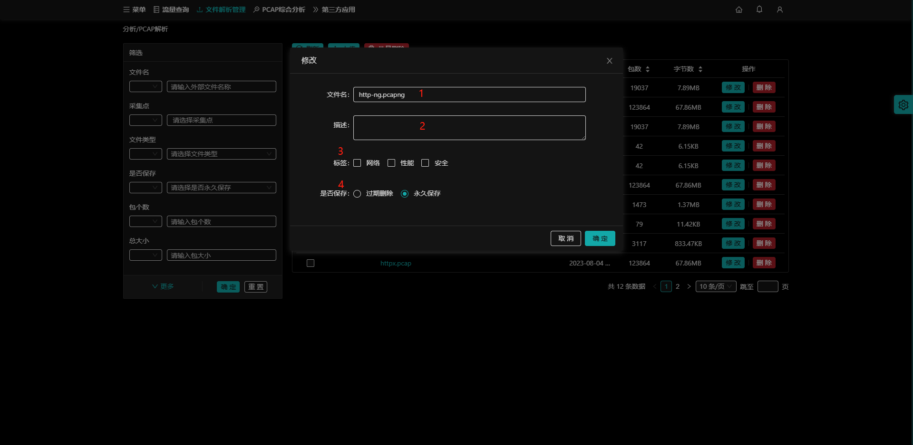
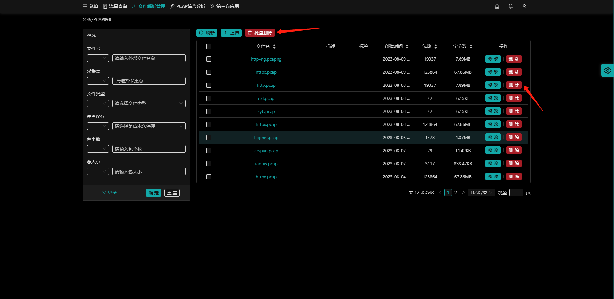
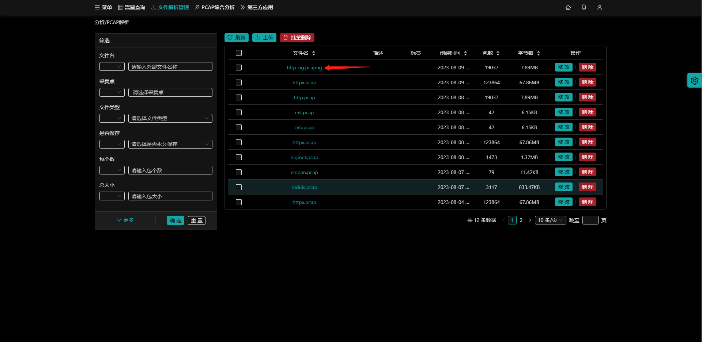

## 简介

`文件解析管理`页面的pcap包管理功能，包含 `上传` 、`修改`、`删除`、`批量删除`功能。

- （1）**刷新** 按钮，刷新pcap包管理列表；
- （2）**上传** 按钮，上传pcap包；
- （3）**批量删除** 按钮，与（4）多选框配合删除多条pcap包；
- （4）多选框；
- （5）**修改** 按钮，修改pcap信息；
- （6）**删除** 按钮，删除所选pcap包；

## pcap包上传

入口：【文件解析管理】-**上传** 按钮

- （1）选择采集点；
- （2）选择本地的pcap文件后自动上传到服务器上；

## pcap包修改

修改pcap文件的相关信息，方便通过这些信息来查询pcap包，不会改变pcap包内的数据。

入口：【文件解析管理】-**修改** 按钮

- （1）文件名；
- （2）描述；
- （3）标签；
- （4）是否保存，默认`永久保存；`
  - `过期删除`是指系统保留一段时间后会自动删除，释放空间。

## pcap包删除

删除已上传的pcap包。

入口：【文件解析管理】-**删除/批量删除** 按钮。

- （1）点击 **删除** 按钮，删除所选pcap文件；
- （2）多选pcap文件，点击 **批量删除** 按钮，删除多个pcap文件；

## 跳转到pcap综合分析页面

可通过鼠标点击pcap文件列表的文件名，跳转到该pcap包的`pcap综合分析`页面。

入口：【文件解析管理】-**pcap文件名** 

- 点击pcap包文件名，跳转到该包的`pcap综合分析`页面；

